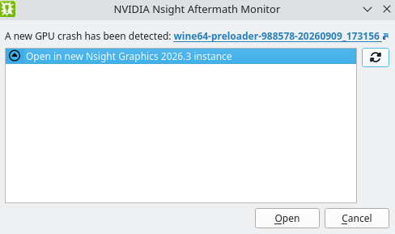
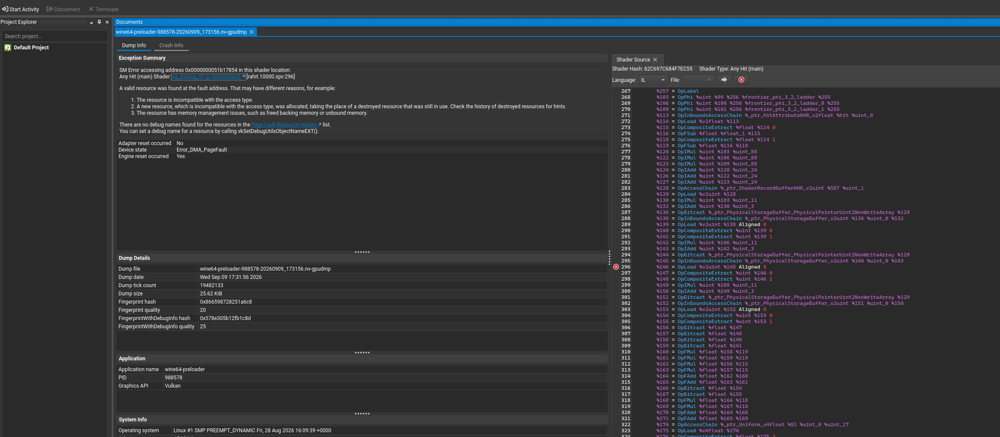
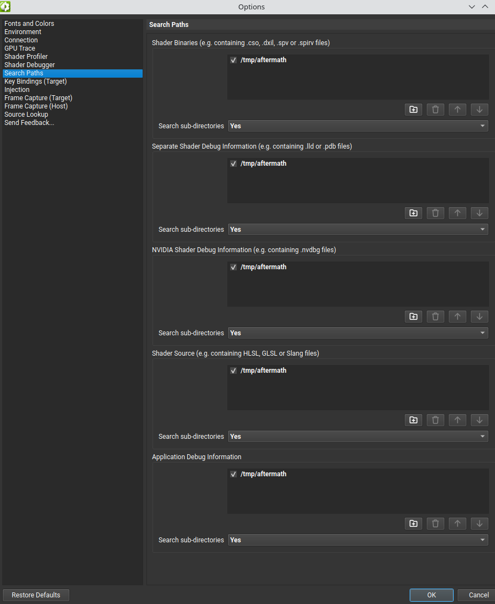

# Getting something out of Aftermath

Apparently it's been possible all along to get this working?
Special thanks to https://github.com/HansKristian-Work/dxil-spirv/pull/306#issuecomment-5572079771
for showing us the way. None of this seems to be documented by NVIDIA which is ... great :(

```
cd ~/nvidia/NVIDIA-Nsight-Graphics-2026.3/host/linux-desktop-nomad-x64
```

First, setup a global aftermath control:

```
$ ./nv-aftermath-control --mode Global --debuginfo 1 --resource-tracking 1 --shader-error-reporting 1 --callstacks 0
```

This creates a file in `~/.nvidia-aftermath-rc`.
Remember to remove this file after you're done.

```
AftermathMode=Global
EnableResourceTracking=Yes
EnableCallStackCapturing=No
GenerateShaderDbgInfo=Yes
EnableShaderErrorReporting=Yes
NumEventsPerBundle=64
NumEventsPerCmdList=1024
NumEventsPerCmdQueue=512
NumEventsPerImmCtx=16384
AppWhitelist=""
```

This seems to be related to the options you can set in `VK_NV_device_diagnostics_config`.
Then, start the monitor:

```
$ mkdir /tmp/aftermath
$ mkdir /tmp/aftermath/dumps
$ mkdir /tmp/aftermath/debuginfo
$ ./nv-aftermath-monitor --crashdump-dir /tmp/aftermath/dumps --debuginfo-dir /tmp/aftermath/debuginfo
```

While that is running launch a game with `VKD3D_SHADER_DUMP_PATH=/tmp/aftermath/debuginfo %command%`.
It does not seem to be necessary to do a pressure-vessel punch-through, but ymmv.

Once the game crashes, a pop-up window should tell you that a crash dump has been made and it prompts you to
open it in Nsight.



If the shader folders are setup properly, the GPU dump should link up with the debuginfo folder
automatically. At least it did for me.



If it doesn't show up try adding the folder manually.


