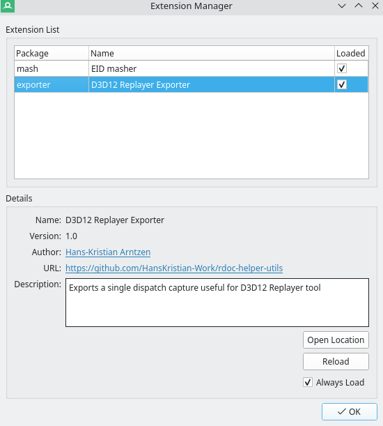
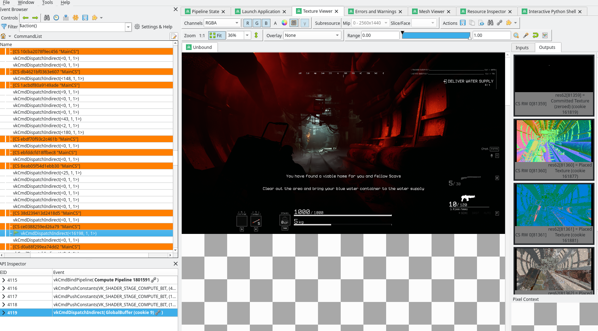

# Single Dispatch Capture Replay flow

There is miscellaneous tooling available to drill out (compute) shader performance.
This is mostly relevant to identify performance outliers between two implementations.
The tooling available for this is:

## Timestamp profiler

This needs `-Denable_profiling=true`.

This is very simple tooling which automatically inserts timestamps around dispatches,
with full barriers around them to ensure that we're timing what we expect.
For now this is isolated to compute for practical reasons,
but it can be trivially extended to graphics as well by hacking the code a bit.

`VKD3D_TIMESTAMP_PROFILE=/tmp/game.csv %command%` emits the last 5 seconds, and refreshes over time.
This is to avoid boot-up sequences impacting the results.

Normally, we would take two timestamp profiles, one for driver A (reference) and one for driver B (the slow driver).
Then, comparative analysis would be:

```
python ./programs/vkd3d-timestamp-profile.py --first /tmp/a.csv --second /tmp/b.csv --threshold 0.1 --count 3
```

The analysis lists the worst outliers in terms of various metrics such as time per invocation, time per dispatch,
total time, etc. Thresholds can be added to avoid extremely short running dispatches to heavily skew the results.
Generally, we're interested in larger dispatches since they actually contribute to frame times.

Timestamp profiling is not as robust as proper profilers,
but it's a good first step to take if you don't know already what you're looking for.

To just look at heavy hitters for a single driver, use --first same as --second, and look at maximal contribution, e.g.:

```
Maximal Time Contribution Analysis (second):
  ==== ca2ad767f52b4181 ====
    Delta first -> second: 0.000 %
      Type: CS
      Total time: (165645.200 us) vs (165645.200 us)
      Total non-PS invocations: (259987392) vs (259987392)
      Total PS invocations: (0) vs (0)
      Total draws/dispatches: (265) vs (265)
      Shader hashes:
        ce0388259ed26a79
      RootSig: 8ecb1cab7a169656

  ...
```

In this case we can look for shader `ce0388259ed26a79` in a RenderDoc capture.
Graphics pipelines will have multiple shader hashes as expected.

## Dumping single dispatches

If the problem can be attributed to poor shader compiler optimization,
the next step is to extract a single dispatch which can be analyzed in isolation.
There's multiple parts to this:

### Dump shaders with `VKD3D_SHADER_DUMP_PATH`

This only needs to be done once for the game, since subsequent steps needs to be able to pull out the
original DXIL shaders. This step can be fused with ...

### Take a RenderDoc capture

Just needs to be of the scene in question which contains the dispatch we're interested in.

### Load the D3D12 exporter UI plugin for RenderDoc

Checkout [rdoc-helper-utils](https://github.com/HansKristian-Work/rdoc-helper-utils) and copy the `exporter` subfolder to
the RenderDoc plugin location as mentioned in the README.



Find the dispatch you're looking for:



Then Window -> Export vkd3d-proton to D3D12 Replayer Capture to export to a folder.
You may be promoted to find the original DXIL. Point it to the `VKD3D_SHADER_DUMP_PATH` folder and it should pick it up.

#### dxil-spirv non-semantic information

To be able to export, a sufficiently new vkd3d-proton build must be used, so that non-semantic information
is embedded. This embeds information on how to parse the push constant block back to root parameters,
and the raw root signature binary is extracted from opcode 1.

```
     %16 = OpExtInstImport "NonSemantic.dxil-spirv.signature"
     %18 = OpString "ResourceTable"
     %66 = OpString "ResourceTable"
     %74 = OpString "CBV"
     %78 = OpString "CBV"
     %80 = OpString "CBV"
     %84 = OpString "CBV"
     %88 = OpString "CBV"
     %92 = OpString "Constant"
    %101 = OpString "SamplerTable"
    %105 = OpString "RootSignature"
     %17 = OpExtInst %void %16 0 %18 %uint_0 %uint_56 %uint_4
     %65 = OpExtInst %void %16 0 %66 %uint_2 %uint_64 %uint_4
     %73 = OpExtInst %void %16 0 %74 %uint_3 %uint_0 %uint_8
     %77 = OpExtInst %void %16 0 %78 %uint_4 %uint_8 %uint_8
     %79 = OpExtInst %void %16 0 %80 %uint_5 %uint_16 %uint_8
     %83 = OpExtInst %void %16 0 %84 %uint_6 %uint_24 %uint_8
     %87 = OpExtInst %void %16 0 %88 %uint_7 %uint_32 %uint_8
     %91 = OpExtInst %void %16 0 %92 %uint_8 %uint_40 %uint_16
    %100 = OpExtInst %void %16 0 %101 %uint_1 %uint_60 %uint_4
    %104 = OpExtInst %void %16 1 %105 %uint_1128421444 %uint_3873082528 ...
```

### The exported format

The exported format (capture.json) can be replayed by [d3d12-replayer](https://github.com/HansKristian-Work/d3d12-replayer).
There's two primary ways to use it:

- Run headless for benchmarking purposes. Use sufficiently large --iterations and --dispatches parameters to make sure GPU is fully saturated.
- Run with a dummy swap chain. This is useful when profiling and re-capturing the dispatch for isolated debug since most tools work on individual swap chain frames.

The replayer runs both on native Linux and Windows. On Windows, it's easy to flip between native D3D12 drivers and vkd3d-proton to get 1:1 comparisons.

#### Native build

```shell
d3d12-replayer --d3d12 /path/to/built/vkd3d-proton/libs/d3d12/libvkd3d-proton-d3d12.so --json /tmp/capture.json
```

#### Windows against native D3D12 drivers

```shell
d3d12-replayer --json /tmp/capture.json
```

The AgilitySDK dlls should be placed automatically next to replayer binary in `D3D12/`, otherwise it won't work.

#### Windows against vkd3d-proton

Place vkd3d-proton's d3d12core.dll (not d3d12.dll!) next to .exe and run:

```shell
d3d12-replayer --json /tmp/capture.json --vkd3d-proton
```

This is a convenient way to load vkd3d-proton without overriding the system-level d3d12.dll which gets annoying when doing
1:1 comparisons.