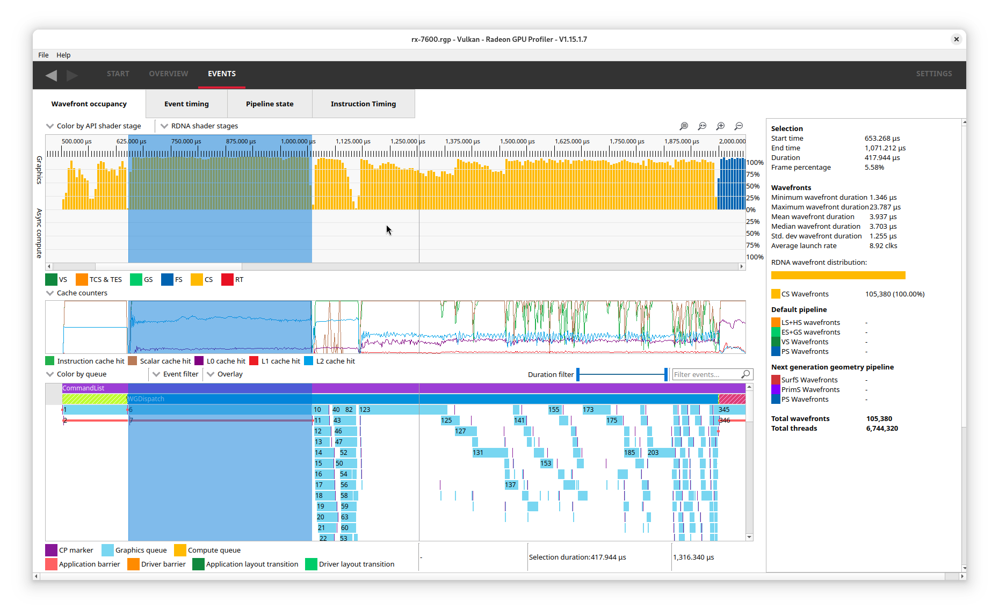

# Workgraphs

## Emulating Workgraphs

Even when we eventually have native work graph support in Vulkan (aside from the AMDX experimental extension),
we will need a plain emulated path. This is critically important for ...

### Debugability

Workgraphs are a complete black box just like RT
with the only observable action being input nodes going in and UAV writes going out.
For debugging on our end (RenderDoc) and crash debug (breadcrumbs), this is completely unacceptable,
and it is critical to have a solid fallback to plain old vkCmdDispatchIndirect that can be stepped through
one-by-one.

Graphics nodes are currently out of scope since it is not released yet outside some early preview SDKs (TIER_1_1).
The current proposal also only supports mesh shaders, which is very compute-like to begin with.
Hopefully we will not design ourselves into a corner here.

While a plain indirect fallback is likely impossible due to the "infinite" potential memory requirements
of workgraphs, we can hopefully support any reasonable content.
Comically large workgraph dispatches will not run acceptably fast on real hardware after all,
and would therefore not be shippable in real content.
The only limiting factor is how much VRAM we're willing to give intermediate buffers,
and sacrificing on the order of 256 MiB is likely acceptable if it means being able to emulate the feature
somewhat competently. 16 GB+ VRAM GPUs tend to have a lot of VRAM to spare anyway.
We could also tweak that requirement on a content-to-content basis if need be.

It should be possible to write a feedback atomic on allocation failure so that vkd3d-proton can flag an error.
A certain mobile IHV is infamous for just randomly DEVICE_LOST-ing on you if you submit too much geometry in a render pass
so ... it's not like there isn't some precedent for these things :D

#### No attempts at work stealing or persistent threads

There are key reasons to avoid doing this:

- Completely un-debuggable. Not as black-box as actual workgraphs, but still extremely difficult to reason about.
It makes printf debugging in RenderDoc only method of seeing flow of data.
- Spinning on GPU to wait for data to arrive is a great way of decimating the effective occupancy and throughput.
There are no yield mechanisms in Vulkan that would fix this.
- Undefined behavior since we're not guaranteed forward progress for a particular workgroup.
This leads to horrible deadlock situations where workgroup A waits for work from workgroup B,
but B is not guaranteed to be scheduled before workgroup A completes execution.

The implementation in vkd3d-proton will aim for debugability (what we care about) and GPU throughput
(what games actually care about). Any attempts at juggling foot-guns will compromise both goals.

## Implementation details

### Global memory ring

Rather than asking applications to allocate *massive* scratch buffers, we could just
have one global buffer per queue family (GRAPHICS and COMPUTE), which are allocated on demand,
and reused between every DispatchGraph.
To synchronize access to the global buffer, we can mark a command list as being work graph
sensitive and do a full serialization of queues in that family on submission.
This can be trivially achieved with a timeline semaphore.
This ensures no synchronization bugs, and should be fine in practice.
It's unlikely that applications will rely on two separate async compute queues doing overlapping graph work in parallel.

Current implementation allocates memory per-workgraph however. For bringup, I suppose this is fine.

### Double buffered

There are node inputs and node outputs.
If our ring is e.g. 1 GB, we can dedicate the lower 512 MB for inputs, and upper half to outputs.
Nodes are allowed to write to the inputs, but application is responsible for dealing with coherency and sync.

The idea is to form a graph of node executions, so that we can do:

- Depth 0: Run entry point nodes
  - Barrier
  - Post-process to set-up indirect compute dispatches, clear counters, etc
  - Barrier
- Depth 1: Run all nodes which are at depth 1
  - Setup for depth 2
- ... and so on. Maximum depth is 32.

Recursion is trivial, we just queue up the same node being executed in multiple levels according to its MaxRecursionDepth.

Between every iteration we can flip the output and input.
This isn't too different from how you'd implement dependent GPU work today.
It's a tried and true path that is fine in most cases, but the deeper the tree, the worse performance gets.

The selling point of workgraphs is that there is no need to idle the GPU between these stages ...
assuming a competent scheduler in hardware.

### Output data structures

#### Allocating payload data

Allocating payloads happens in two phases. This is done to keep memory footprint as low as possible.
A common problem with the ExecuteIndirect style is that we have to allocate a block of memory per potential output node
and atomically append to that block. Since payloads can get quite large, allocating for the worst case
is a disaster.

The solution I came up with instead is to allocate payloads from a common buffer, and only record references
to that allocation per-node.

E.g. for group allocation:

```glsl
uint AllocateGroupNodeRecords(
    uint64_t AtomicCountersBDA, uint NodeMetadataIndex,
    uint Count, uint Stride, uint AllocationOffset)
{
    if (Count == 0u)
    {
        return 0u;
    }
    if (gl_LocalInvocationIndex == 0u)
    {
        _171 _173 = _171(AtomicCountersBDA);

        // Allocate memory for Count entries aligned to 16 bytes.
        // Stride is compile-time constant and depends on the payload data type + metadata.
        uint _176 = atomicAdd(_173.payloadCount, ((Count * Stride) + 15u) & 4294967280u);

        // Allocate a reference entry. Only needs two u32s for up to 256 allocations.
        uint _182 = atomicAdd(_173.fusedCount, 1u);

        // Record the total number of nodes so that we can prefix-sum allocate payload offsets later.
        uint _178 = atomicAdd(_173.perNodeTotal[NodeMetadataIndex], Count);
        uint _184 = AllocationOffset + (2u * _182);
      
        // Record node/count/payload offset. Read by payload expander later.
        _173.perNodeTotal[_184] = (NodeMetadataIndex << 8u) | (Count - 1u);
        _173.perNodeTotal[_184 + 1u] = _176;
        AllocateGroupNodeRecordsShared = _176;
    }

    // Must be called in uniform control flow.
    // Sandwich barrier to avoid WAR hazards for back to back allocations.
    barrier();
    uint _189 = AllocateGroupNodeRecordsShared;
    barrier();
    return _189;
}
```

It would be too cumbersome to have the downstream nodes consume the array payload format,
so later we run a payload expansion pass which expands this formulation to array of simple u32 offsets.
At that time we know how many entries there are for each node, so can get perfect memory compaction
and the problem of too many nodes goes away.
If we were to unroll in the shader, memory requirements would be far more problematic.

Another advantage is that we don't have to care about `OutputComplete` at all. It's a noop.

Getting pointer to payload is simple with some pointer arithmetic and casting (BDA <3).

```
uint _117 = AllocateThreadNodeRecords(
      NodeDispatch.NodePayloadOutputAtomicBDA, Broadcast0,
      Count, 12u, NodeDispatch.NodePayloadOutputOffset,
      NodeDispatch.NodePayloadOutputStride);
      
uint _137 = Index * 12u;
UserPointerType _141 = _132(NodeDispatch.NodePayloadOutputBDA + uint64_t(_117 + _137));
```

Nodes can also be called per-thread. If we deduce the node index is wave uniform,
the code is straight forward subgroup code with typical reductions, elections, scans, etc.

If the node index is not wave uniform, we need a waterfall loop.

```glsl
uint AllocateThreadNodeRecordsWaterfall(
        uint64_t AtomicCountersBDA, uint NodeMetadataIndex,
        uint Count, uint Stride, uint AllocationOffset)
{
    uint _128;
    for (;;)
    {
        uint _126 = subgroupBroadcastFirst(NodeMetadataIndex);
        if (_126 == NodeMetadataIndex)
        {
            _128 = AllocateThreadNodeRecords(AtomicCountersBDA, _126, Count, Stride, AllocationOffset);
            break;
        }
        continue;
    }
    return _128;
}
```

Per-thread allocations requires `VK_KHR_maximal_reconvergence` to be technically correct.
We can safely rely on this extension to enable workgraphs.

#### RW tracking

Node inputs to broadcast nodes can be `RW` tracking. The spec explicitly outlines that implementations should
reserve a uint in the payload struct to hold the necessary count.

This count could in theory be computed in the shader that allocates the record, but there are many edge cases to consider,
especially when a thread allocates more than 1 record (requiring a very ugly loop), so we don't.
Instead, initializing the counter takes place during the payload offset expansion pass.

`FinishedCrossGroupSharing()` can be implemented with a simple atomic decrement.
The intent of this API is to support single-pass down-sampling or similar things.
This call must be dispatch grid uniform (is that stronger than thread group uniform? :v).
This requirement is useful since we don't have to auto-insert
`FinishedCrossGroupSharing()` at the end of the shader if the threadgroup didn't happen to call it.

By spec, this mechanism is not supported for entry points, so we don't have to deal with that mess (phew).
It is also not supported by node payload sharing (phew!).

```hlsl
[Shader("node")]
[NodeLaunch("broadcasting")]
[NumThreads(64, 1, 1)]
[NodeMaxDispatchGrid(1024, 1, 1)]
[NodeID("Broadcast", 0)]
void Broadcast0(globallycoherent RWDispatchNodeInputRecord<SharedPayload> payload, uint thr : SV_GroupIndex)
{
	uint o;
	InterlockedAdd(payload.Get().num_atomics, 1, o);
	Barrier(payload, GROUP_SYNC | GROUP_SCOPE | DEVICE_SCOPE);
	// Spec seems to imply we need to have a barrier outselves. WARP fails if we don't.
	if (payload.FinishedCrossGroupSharing())
	{
		InterlockedAdd(RWBuf0[thr], payload.Get().num_atomics, o);
	}
}
```

```glsl
bool FinishCrossGroupSharing(uint64_t CounterBDA)
{
    // HLSL does not 
    if (gl_LocalInvocationIndex == 0u)
    {
        uint _76 = atomicAdd(uintPointer(CounterBDA), uint(-1));
        FinishCrossGroupSharingBroadcast = _76 == 1u;
    }
    barrier();
    return FinishCrossGroupSharingBroadcast;
}

void node_main()
{
    uint64_t _54 = NodeInputPayloadBDA;
    _51 _55 = _51(_54);
    uint _60 = atomicAdd(_55.data._m1, 1u);
    memoryBarrier();
    barrier();
    uint64_t _81 = NodeInputPayloadBDA;
    // We allocate a u32 counter at the end of node payload.
    // The offset is compile time constant based on the user payload type.
    // The value is written by internal metadata shader during payload expansion pass.
    bool _84 = FinishCrossGroupSharing(_81 + 8ul);
    if (_84)
    {
        uint _89 = atomicAdd(RWBuf0._m0[gl_LocalInvocationIndex], _55.data._m1);
    }
}
```

The internal meta shader will do something like:

```glsl
layout(constant_id = 1) const int GROUP_COMPONENTS = 0;
layout(constant_id = 2) const bool GROUP_COMPONENTS_U32 = false;
layout(constant_id = 3) const bool RW_GROUP_TRACKING = false;

if (GROUP_COMPONENTS > 0)
{
    uint grid_count = 1u;
    if (registers.grid_offset_or_count >= 0)
    {
        // For [NodeMaxDispatchGrid].
        if (GROUP_COMPONENTS_U32)
        {
            uint u32_grid_offset = (unrolled_offset + registers.grid_offset_or_count) >> 2u;
            for (int i = 0; i < GROUP_COMPONENTS; i++)
                grid_count *= registers.payload.data[u32_grid_offset + i];
        }
        else
        {
            uint u16_grid_offset = (unrolled_offset + registers.grid_offset_or_count) >> 1u;
            for (int i = 0; i < GROUP_COMPONENTS; i++)
                grid_count *= uint(Payload16(registers.payload).data[u16_grid_offset + i]);
        }
    }
    else
    {
        // For [NodeDispatchGrid]. Ignore any grids.
        grid_count = -registers.grid_offset_or_count;
    }

    if (RW_GROUP_TRACKING)
        registers.payload.data[(unrolled_offset + registers.payload_stride - 4u) >> 2u] = grid_count;
}
```

#### Recursion

Recursion is not particularly difficult. The same compute shader will just be invoked at multiple levels.
`IsValid()` and `GetRemainingRecursionLevels()` can both be implemented by passing down a push constant.

#### IsValid

It is possible to pass spec constants and form a spec constant LUT, which can be looked up. E.g.

```
layout(constant_id = 0) const bool NODE_0_VALID = false;
layout(constant_id = 1) const bool NODE_1_VALID = false;
layout(constant_id = 2) const bool NODE_2_VALID = false;
layout(constant_id = 3) const bool NODE_3_VALID = false;
const bool IS_VALID_LUT[] = bool[](NODE_0_VALID, NODE_1_VALID, ...);
```

This can handle sparse node arrays (some nodes may not be valid).
We also have to deal with range checking, so that querying unbounded node arrays work, but all
of this can be handled with spec constants. If we have to consider COLLECTIONs later, we might have to
make this query dynamic using push UBOs.

For now, IsValid is not really implemented except for recursive nodes.
It's implementable if a game relies on it.

#### Local root signatures

Just like DXR, a node can have a local root signature assigned to it.
Each node has a local root signature index assigned to it.
On the API side we're provided a strided buffer which backs local arguments per node.
The node at local index `L` will view local root signature data at address:

`ShaderRecordAddr = StartAddress + StrideInBytes * L`

This is trivially implemented as a push BDA.
dxil-spirv has an option to replace `layout(shaderRecordEXT)` with push BDA.
Otherwise, they both function like normal buffer blocks, with different storage classes.

#### Binding model

There are many possibilities here, but the current thinking is that workgroup specific metadata is
passed through push constants, and global root signature parameters are passed as a push UBO.
Using pipeline layout compatibility like with DXR, we can append internal descriptor set layouts as appropriate.

It's not possible to use normal compute PSOs as nodes, so we can use different binding models for workgraphs and normal PSOs.

- One immutable sampler set for local root signature static samplers.
- One push buffer set to pass down various meta-data needed to execute a node.

We have to ban user push UBOs here since it's not legal to have multiple push descriptor sets.
This shouldn't be a big problem. Just like DGC we require the appropriate vkd3d-config flag on NVIDIA.
The push UBO path will eventually have to go on NVIDIA anyway ...

Like DXR, we may have to insert `nonuniformEXT` in more places than we expect, especially for thread node.
The members are explained in more detail later.

```
struct vkd3d_shader_node_input_push_signature
{
    VkDeviceAddress node_payload_bda;
    VkDeviceAddress node_linear_offset_bda;
    VkDeviceAddress node_total_nodes_bda;
    VkDeviceAddress node_payload_stride_or_offsets_bda;
    VkDeviceAddress node_payload_output_bda;
    VkDeviceAddress node_payload_output_atomic_bda;
    VkDeviceAddress local_root_signature_bda;
    uint32_t node_payload_output_offset;
    uint32_t node_payload_output_stride;
    uint32_t node_remaining_recursion_levels;
};
```

### Executing nodes

When emitting code in dxil-spirv, we cannot avoid the need to generate a "wrapper" of some sort,
which receives work and sets up shader inputs.

```
PayloadPtr ptr;
void real_node_main() { ... }

void main() { convert_dispatch_grid(); ptr = set_input_payload(); real_node_main(); }
```

Using two indirect dispatches, we can emit an arbitrary number of 1D work groups.
This is slightly tricky, because the maximum group count dimension is `2^16 - 1`,
so unfortunately, we cannot rely on simple 1D workgroup dispatch.
To emit N workgroups, we can dispatch twice:

```
(2^15, N / 2^15, 1)
(N % 2^15, 1, 1)
```

NOTE: Recently RADV also gained support for > 64k workgroups in the first dimension, so
we can avoid the unrolling, and simply put everything in the second dispatch.
The current implementation supports this optimization.

To obtain the base offset for the dispatch `node_linear_offset_bda` is used.
Alternatively, one dispatch can loop to cover large N, but that adds more complexity to dxil-spirv codegen.

The shaders can then translate linear work group ID into the appropriate data needed for the node.
The implementation detail of these changes depending on the situation.

#### Different entry point configurations

There are 4 different strategies for how to execute an entry point.
All of these code paths are resolved through specialization constants.
Actual example code will be given per launch type below.

##### Single record, CPU_INPUT entry point, broadcast node

This is a trivial case where we can just figure out the 3D dispatch grid and execute that as a simple
`vkCmdDispatch`. This seems to be a common case for entry points. Both AMD's SimpleClassify and ComputeRasterizer
demos use this style. `node_payload_stride_or_offsets_bda` is ignored, since there is only one entry record.

##### Generic CPU_INPUT entry point

`node_payload_stride_or_offsets_bda` is treated as an immediate u32 stride.
For specific `SV_DispatchGrid` handling, see broadcast section below.

##### GPU_INPUT entry point

This is similar to CPU_INPUT, but the input payload BDA is treated as a pointer-to-pointer, since we
don't know the payload BDA on CPU record time, we only know the pointer to the buffer which contains the pointer ...
`node_payload_stride_or_offsets_bda` is treated a pointer to u32 stride as expected.

##### Non-entry point

`node_payload_stride_or_offsets_bda` is a pointer to a u32 array. Every record has a u32 offset into the payload BDA.

##### Specialization constants

With spec constants, we only have to convert the entry points once and we don't need to pass modified metadata
back into the shader compiler. In the D3D12 API it's possible to modify a lot of the metadata.
The only thing that cannot be changed is the launch type. For this reason, every assumption we cannot make statically
needs to become a spec constant. All that code will have to be dead-code-eliminated by the Vulkan driver, but that's okay.

#### Thread

We will pick an appropriate thread group size, which should be equal to maximum subgroup size.
Once we have the total node count `T`, `N = alignDiv(T, SubgroupSize)`, and the shader can handle edge case of unaligned
size in last thread group trivially.

The workgroup size of thread nodes needs to be chosen with care. Thread nodes can emit up to 8 records (instead of 256),
and since we can store 256 compacted records, we cannot safely use more than wave32 in the worst case.
For now, we just hardcode 32 workgroup size for thread nodes, but it could cater to wave64 as well should there be a need.

```glsl
layout(local_size_x_id = 0, local_size_y_id = 1, local_size_z_id = 2) in;

uint64_t NodeInputPayloadBDA;

void node_main()
{
    // App code
}

void main()
{
    uint _77 = ((((gl_WorkGroupID.y * 32768u) + gl_WorkGroupID.x) * gl_WorkGroupSize.x) + gl_LocalInvocationIndex) + NodeDispatch.NodeLinearOffsetBDA.value;
    NodeInputPayloadBDA = NodeDispatch.PayloadLinearBDA;
    if (NodeIsProgramEntry)
    {
        // For entry points only.
        NodeInputStride = NodeDispatch.NodePayloadStrideOrOffsetsBDA.x;
        if (NodeEntryIndirectPayloadStride)
        {
            // GPU_INPUT node. Load addr + stride from the GPU buffer.
            NodeInputPayloadBDA = NodeReadonlyU64Ptr(NodeDispatch.PayloadLinearBDA).value;
            NodeInputStride = NodeReadonlyU32Ptr(NodeDispatch.NodePayloadStrideOrOffsetsBDA).value;
        }
    }
    if (NodeIsProgramEntry)
    {
        // Handle partially full workgroups. We'll only have one of those.
        if (_77 < NodeDispatch.NodeEndNodesBDA.value)
        {
            // Entry point path. Payload is given a simple strided array.
            NodeInputPayloadBDA += uint64_t(_77 * NodeInputStride);
            node_main();
        }
    }
    else
    {
        // Handle partially full workgroups. We'll only have one of those.
        if (_77 < NodeDispatch.NodeEndNodesBDA.value)
        {
            // Non-entry points. Load payload offset from buffer.
            NodeInputPayloadBDA += uint64_t(NodeReadonlyU32ArrayPtr(NodeDispatch.NodePayloadStrideOrOffsetsBDA).offsets[_77]);
            node_main();
        }
    }
}
```

#### Coalesced

Very similar to thread model. We just have to divide with MaxCoalesceSize as defined by shader instead of
subgroup sizes. Instead of masking execution ourselves, we will pass the count to shader instead and let it deal with it.

```hlsl
RWStructuredBuffer<uint> RWBuf : register(u0);

struct Payload
{
	uint idx;
	uint v;
};

[Shader("node")]
[NodeLaunch("coalescing")]
[NumThreads(24, 1, 1)]
void CoalesceNode([MaxRecords(3)] GroupNodeInputRecords<Payload> payload, uint thr : SV_GroupThreadID)
{
	uint count = payload.Count();
	for (uint i = 0; i < count; i++)
	{
		Payload p = payload.Get(i);
		uint o;
		InterlockedAdd(RWBuf[p.idx + thr], p.v, o);
	}
}
```

```glsl
uint64_t NodeInputPayloadBDA;
uint NodeInputStride;
uvec3 GlobalInvocationID;
uint NodeCoalesceOffset;
uint NodeCoalesceCount;

// Have to defer lowering the pointer to payload since we have to differentiate between program entry and non-entry.
uint NodeCoalescePayloadOffset(uint offset, uvec2 offsets_bda)
{
    uint _72;
    if (NodeIsProgramEntry)
    {
        _72 = NodeInputStride * offset;
    }
    else
    {
        _72 = NodeReadonlyU32ArrayPtr(offsets_bda).offsets[offset];
    }
    return _72;
}

void node_main()
{
    uint _47 = NodeCoalesceCount;
    if (!(_47 == 0u))
    {
        uint _49;
        _49 = 0u;
        for (;;)
        {
            _52 _81 = _52(NodeInputPayloadBDA + uint64_t(NodeCoalescePayloadOffset(NodeCoalesceOffset + _49, NodeDispatch.NodePayloadStrideOrOffsetsBDA)));
            uint _91 = atomicAdd(RWBuf._m0[_81.data._m0 + gl_LocalInvocationID.x], _81.data._m1);
            uint _50 = _49 + 1u;
            if (_50 == _47)
            {
                break;
            }
            else
            {
                _49 = _50;
            }
        }
    }
}

void main()
{
    uint _106 = (((gl_WorkGroupID.y * 32768u) + gl_WorkGroupID.x) * 3u) + NodeDispatch.NodeLinearOffsetBDA.value;
    NodeInputPayloadBDA = NodeDispatch.PayloadLinearBDA;
    if (NodeIsProgramEntry)
    {
        NodeInputStride = NodeDispatch.NodePayloadStrideOrOffsetsBDA.x;
        if (NodeEntryIndirectPayloadStride)
        {
            NodeInputPayloadBDA = NodeReadonlyU64Ptr(NodeDispatch.PayloadLinearBDA).value;
            NodeInputStride = NodeReadonlyU32Ptr(NodeDispatch.NodePayloadStrideOrOffsetsBDA).value;
        }
    }
    NodeCoalesceOffset = _106;
    NodeCoalesceCount = min((NodeDispatch.NodeEndNodesBDA.value - _106), 3u);
    node_main();
}
```

#### Broadcast

This one is more tricky, since grid size implies additional amplification on top of the other amplification.
E.g. a thread can generate 5 node outputs, which are then written with grid sizes of
(8, 7, 3), (2, 11, 6), (3, 2, 1), (1, 0, 1) and (10, 10, 10).
It would be extremely impractical to unroll that level of amplification,
so instead the idea is to use the Z dimension of the dispatch to encode amplification.

It would be tempting to use `VK_EXT_device_generated_commands`, but the number of dispatches
being emitted is basically unknowable at CPU record time, making DGC a dead end.
We have to be a bit smarter about it.

The shader will have loop through the amplification on its own.
The obvious trade-off is a little worse debugability, and performance can be questionable for highly variable grid sizes.
Unfortunately, the AMD demos forced me into making the code a bit more degenerate than it should have ideally been.
They use massive MaxDispatchGrid values, meaning we cannot rely on them being reasonable. :(

#### [NodeDispatchGrid]

Static amplification is easy. E.g.:

```hlsl
RWStructuredBuffer<uint> RWBuf : register(u0);

struct Payload
{
	uint v;
	uint w;
};

[Shader("node")]
[NodeLaunch("broadcasting")]
[NodeDispatchGrid(3, 3, 2)]
[NumThreads(2, 3, 4)]
void BroadcastNode(DispatchNodeInputRecord<Payload> payload, uint3 thr : SV_DispatchThreadID)
{
	uint idx = thr.z * 100 + thr.y * 10 + thr.x;
	uint o;
	InterlockedAdd(RWBuf[idx], payload.Get().v ^ payload.Get().w, o);
}
```

The preamble is similar to the others, but we have a difference in that `DispatchStaticPayload` is used to optimize for
CPU_INPUT entry points with a single record. We just inherit `WorkGroupID` directly into `SV_DispatchGrid`.
This is the ideal case and both AMD demos hit this case, which is why we have a dedicated path for it.

```glsl
uint _94 = DispatchStaticPayload ? NodeDispatch.NodeLinearOffsetBDA.value : (((gl_WorkGroupID.y * 32768u) + gl_WorkGroupID.x) + NodeDispatch.NodeLinearOffsetBDA.value);
NodeInputPayloadBDA = NodeDispatch.PayloadLinearBDA;
if (NodeIsProgramEntry)
{
    NodeInputStride = NodeDispatch.NodePayloadStrideOrOffsetsBDA.x;
    if (NodeEntryIndirectPayloadStride)
    {
        NodeInputPayloadBDA = NodeReadonlyU64Ptr(NodeDispatch.PayloadLinearBDA).value;
        NodeInputStride = NodeReadonlyU32Ptr(NodeDispatch.NodePayloadStrideOrOffsetsBDA).value;
    }
}
```

##### Static payload path

```glsl
// Inside a lot of spec constant branch guts
if (DispatchStaticPayload)
{
    WorkgroupID = gl_WorkGroupID;
    GlobalInvocationID = gl_GlobalInvocationID;
    node_main();
}
```

##### Amplification case

Dividing by constant uint isn't particularly slow, so we can go ahead.
Idea is to compute the total amplification, then loop.
This loop can work with any gl_NumWorkGroups.z in theory.

```glsl
layout(constant_id = 7) const uint MaxBroadcastGridX = 3u;
layout(constant_id = 8) const uint MaxBroadcastGridY = 3u;
layout(constant_id = 9) const uint MaxBroadcastGridZ = 2u;

const uint _150 = (MaxBroadcastGridX * MaxBroadcastGridY);
const uint _151 = (_150 * MaxBroadcastGridZ);

for (uint amplification_index_2 = gl_WorkGroupID.z; amplification_index_2 < _151; amplification_index_2 += gl_NumWorkGroups.z)
{
    uint _156 = amplification_index_2 / MaxBroadcastGridX;
    uvec3 _159 = uvec3(amplification_index_2 % MaxBroadcastGridX, _156 % MaxBroadcastGridY, _156 / MaxBroadcastGridY);
    WorkgroupID = _159;
    GlobalInvocationID = (ThreadGroupSize * _159) + gl_LocalInvocationID;
    node_main();
  
    // At start of a workgroup, shaders can assume that it's safe to touch shared memory.
    barrier();
}
```

This style of amplification will **not** work for mesh shaders since we cannot allocate geometry in a loop like this.
The potential workaround here is to statically unroll the loop by emitting a MDI and use DrawIndex to encode loop iteration.
Extremely cursed, but everything about workgraphs is extremely cursed.

#### [NodeMaxDispatchGrid]

Dynamic amplification is fiendish. AMD's compute rasterization demo hits this in very complicated ways,
so we have to pull out some degenerate strategies to get anywhere.

```hlsl
RWStructuredBuffer<uint> RWBuf : register(u0);

struct Payload
{
	uint v;
	uint16_t2 size : SV_DispatchGrid;
	uint w;
};

[Shader("node")]
[NodeLaunch("broadcasting")]
[NodeMaxDispatchGrid(3, 3, 2)]
[NumThreads(2, 3, 4)]
void BroadcastNode(DispatchNodeInputRecord<Payload> payload, uint3 thr : SV_DispatchThreadID)
{
	uint idx = thr.z * 100 + thr.y * 10 + thr.x;
	uint o;
	InterlockedAdd(RWBuf[idx], payload.Get().v ^ payload.Get().w, o);
}
```

This may be over-engineering, but I wanted to avoid dynamic division by uint in a loop.

```glsl
// Load the grid size.
uvec2 _207 = uvec2(u16vec2Pointer(NodeInputPayloadBDA + 4ul).value);

// Compute how many bits are needed for DispatchGrid.x.
uint _209 = _207.x - 1u;
uint _211 = uint(findMSB(_209)) + 1u;
uint _212 = _207.y;

// Compute how many bits are needed for DispatchGrid.y.
uint _213 = _212 - 1u;
uint _215 = uint(findMSB(_213)) + 1u;

// Compute total number of iterations needed to guarantee that we observe all valid GroupIDs.
// Need special handling of empty grid.
uint _222 = any(lessThan(ivec2(uvec2(_209, _213)), ivec2(uvec2(0u)))) ? 0u : (_212 << _211);

// This is all scalar math at least :) Should run great on AMD.

for (uint amplification_index_1 = gl_WorkGroupID.z; amplification_index_1 < _222; amplification_index_1 += gl_NumWorkGroups.z)
{
    // Generate a candidate GroupID.
    uvec3 _228 = uvec3(bitfieldExtract(amplification_index_1, int(0u), int(_211)), bitfieldExtract(amplification_index_1, int(_211), int(_215)), 0u);
    WorkgroupID = _228;
    GlobalInvocationID = (ThreadGroupSize * _228) + gl_LocalInvocationID;
  
    // If that candidate was in-range, accept it.
    if (all(lessThanEqual(_228, uvec3(_209, _213, 0u))))
    {
        node_main();
        barrier();
    }
}
```

The big question now is how large NumWorkGroups.z should be.
If it's too low, we end up with horrible occupancy if there are a few outliers with very long-running code.
If it's too high, we destroy occupancy by flooding the GPU with useless work.
AMD's compute rasterizer demo hits a serious worst case that forced some awkward heuristics.

The first heuristic is to compute the maximum amplification on workgraph creation.
Clamp this to a sane value since the MaxGrid can be ridiculously large, but must not exceed 2^24 total groups.

```c
// Arbitrarily chosen
#define MAX_AMPLIFICATION_RATE 1024u
uint32_t max_amplification =
  node_input->broadcast_grid[0] *
  node_input->broadcast_grid[1] *
  node_input->broadcast_grid[2];
max_amplification = min(max_amplification, MAX_AMPLIFICATION_RATE);
```

Setting up the initial WorkGroupSize.z estimate is done by reducing the amplification when number of workgroups is large.
```glsl
// Try to balance work we spawn on the GPU.
// AMPLIFICATION_EXTRA_SHIFT is an arbitrarily chosen value.
amplification = max(1u, amplification >> findMSB(max(total_wgs >> AMPLIFICATION_EXTRA_SHIFT, 1u)));
```

When expanding the payload offsets, we have a bit more information since we can inspect the actual payloads.
We maintain a counter of total non-empty nodes emitted, and then count number of total workgroups emitted.
This can overflow, but that's okay.
We make a crude estimate that amplification rate should be the average number of workgroups per record.
This seems to solve the AMD compute rasterization demo where we avoid both problems of too low occupancy and too many redundant threads.
Obviously, this is just one example, but I believe this heuristic is principled.

There is a practical limitation in the implementation where
this path can only be used if there are less than 32k records being dispatched.
`should_compact_broadcast` is set to false when it's not feasible to use compaction + heuristic.
Over 32k broadcast nodes with variable grid size should hopefully not happen in practice :').

```glsl
if (should_compact_broadcast)
{
    memoryBarrierBuffer();
    barrier();

    if (gl_LocalInvocationIndex == 0)
    {
        restrict IndirectCommandsBufferAtomic atomics = IndirectCommandsBufferAtomic(registers.commands);
        uint counter = atomicAdd(atomics.indirect_commands_atomic[registers.node_index].expander_workgroup_counter, 1u);

        if (counter + 1 == gl_NumWorkGroups.x)
        {
            // Reset counter for next iteration, need atomic to ensure it's a coherent write.
            atomicAnd(atomics.indirect_commands_atomic[registers.node_index].expander_workgroup_counter, 0u);
            // Exchange to get coherent read and reset to 0, nifty.
            uint total_groups = atomicExchange(atomics.indirect_commands_atomic[registers.node_index].expander_total_groups, 0u);
            uint wgx = atomicOr(atomics.indirect_commands_atomic[registers.node_index].secondary_execute.x, 0u);
            uint average_amplification = uint(float(total_groups) / float(max(1u, wgx)));
            atomicMax(atomics.indirect_commands_atomic[registers.node_index].secondary_execute.z, average_amplification);
        }
    }
}
```

There are potential ways to improve on this, by having multiple dispatches, each designed for their own amplification factors,
but that requires extra passes to resolve, and that's getting much too complicated.
That might be a decent use case for DGC, albeit very complex.

### Node sharing

Node inputs can be shared by multiple nodes. In principle, this is straight forward to implement.
We just set up multiple dispatches that each point to the same payload data.
There are problems with `[NodeMaxDispatchGrid]` however. We can only handle naive selection of WorkGroupSize.z since
we don't want to have an extra pass after payload expansion to resolve that. I hope this case never comes up in practice.

```glsl
if (subgroupAny(has_share_input))
{
    subgroupMemoryBarrierBuffer();
    subgroupBarrier();

    // There cannot be chains of sharing, i.e. you cannot have A sharing with B, and B sharing with C,
    // so this cannot cause any weird WAR hazard.

    for (uint i = gl_SubgroupInvocationID; i < registers.num_nodes; i += gl_SubgroupSize)
    {
        uint sharing_index = registers.node_share_mapping.data[i];
        if (sharing_index != ~0u)
        {
            // We need to know the primary_linear_offset to set up the indirect properly.
            IndirectCommands other_cmd = registers.commands.indirect_commands[sharing_index];
            IndirectCommands cmd = registers.commands.indirect_commands[i];
          
            // ...

            // Copy payload offsets into shared input.
            registers.commands.indirect_commands[i].primary_execute.z = amplification;
            registers.commands.indirect_commands[i].secondary_execute.z = amplification;
            registers.commands.indirect_commands[i].primary_linear_offset = other_cmd.primary_linear_offset;
            registers.commands.indirect_commands[i].secondary_linear_offset = other_cmd.primary_linear_offset + cmd.primary_execute.y * WG_DIVIDER * coalesce_mult;
            registers.commands.indirect_commands[i].end_elements = other_cmd.end_elements;
        }
    }
}
```

## API side

One of the biggest pain points will be dealing with the extremely awkward subobject-based API.
It took the worst parts of DXR and made it even worse. :(

A key part of this API is that all metadata from the DXIL shader can be overridden using subobjects
that override other subobjects. This can be implemented with specialization constants.
We just need an API in dxil-spirv to reflect all metadata associated with an entry point.
This isn't too far removed from DXR.

### CPU node input

For CPU inputs, we have full knowledge up-front about how many nodes are being executed.
The main concern here is that we need to step through the buffer, `vkCmdUpdateBuffer` as appropriate,
and set up the input data structures, so we can start the dispatch.

From a memory management PoV it's possible to be somewhat robust against overflows.
Based on max node output limits we can statically determine maximum theoretical limits for how much
memory would be needed to execute a node input. If at least a single node's theoretical fan-out can fit in memory,
we know for sure that execution can succeed if we're willing to accept horrible performance and
split `DispatchGraph()` into N iterations. However, even *this* cannot be guaranteed in the theoretical extreme.
`MULTI_CPU_INPUT` is similar here, it's just a more elaborate way of expressing CPU nodes.

In the current implementation, there's no consideration for splitting execution like this.
If it becomes critical to make an important game run well, we can consider it.

### GPU node input

```
typedef struct D3D12_NODE_GPU_INPUT
{
    UINT EntrypointIndex;
    UINT NumRecords;
    D3D12_GPU_VIRTUAL_ADDRESS_AND_STRIDE Records;
} D3D12_NODE_GPU_INPUT;
```

In this scenario we can dynamically select the EntrypointIndex, but all payload data is linear in memory.

Entry point nodes take raw BDA + stride as payload input instead of looking up payload offsets.
In plain Vulkan 1.3, we unroll indirect dispatches per-entry point.

```glsl
void main()
{
	uint id = gl_GlobalInvocationID.x;
	if (id < registers.num_entry_points)
	{
		// For shared input nodes, there can be multiple nodes executing for any given input.
		if (registers.entry_point_mapping.data[id] == registers.node_input.entry_point_index)
		{
			// ... compute amplification factors, wg_count for coalescing, etc ...
			IndirectCommand cmd;
			cmd.primary_dispatch_and_offset = uvec4(WG_DIVIDER, wg_count / WG_DIVIDER, amplification, 0);
			cmd.secondary_dispatch_and_offset = uvec4(wg_count % WG_DIVIDER, 1, amplification,
					cmd.primary_dispatch_and_offset.y * WG_DIVIDER * coalesce_mult);
			registers.indirects.commands[id] = cmd;
		}
		else
		{
			registers.indirects.commands[id] = IndirectCommand(uvec4(0), uvec4(0));
		}
	}
}
```

This can be improved greatly with `EXT_device_generated_commands` since we can only emit the relevant entry points.
This is mostly relevant for scenarios where number of entry points is very large for whatever reason.

### Multi-GPU node input

```
typedef struct D3D12_MULTI_NODE_GPU_INPUT
{
    UINT NumNodeInputs;
    D3D12_GPU_VIRTUAL_ADDRESS_AND_STRIDE NodeInputs; // D3D12_GPU_NODE_INPUT array
} D3D12_MULTI_NODE_GPU_INPUT;
```

This is where true hell begins because unlike MDI, there is no MaxCommands here. It's impossible to determine
at CPU time how much memory may be consumed. We will need to dispatch a compute shader that parses the GPU node
data structures and instead of allocating payload memory, we just write the pointer to the payload memory instead.

It's plausible that DGC will come in clutch here.
We won't know NumNodeInputs, but if we assume some reasonable upper limit, we could generate an indirect command stream
similar to plain GPU_INPUT.

`NumNodeInputs` becomes the indirect count. It will be clamped to our maximum assumption (say e.g. 4k).

We can dispatch 4096 compute threads. They can process and generate 2 indirect dispatches.

```
NodeInputs[i].EntryPoint -> convert to 64-bit compute VA (PIPELINE token) through lookup
NodeInputs[i].Records -> convert to push constant update
NodeInputs[i].NumRecords -> convert to 3D dispatch grid (DISPATCH token)
```

This way it should be possible to drive the first level of the graph.
A non-DGC fallback would be even more horrid to implement :(
This is currently unimplemented. Hopefully this won't come up in practice.

### COLLECTION

Unimplemented. A crude implementation will be to recompile the entire thing every time.
There are no group handles that have to remain invariant, which helps ...

### Node overrides

Unimplemented. Shouldn't be too hard in theory with the spec constant formulation. Just need to write tests.

## Internal meta shaders

There are three meta shaders to drive workgraphs.

### `cs_workgraph_setup_gpu_input.comp`

This is only used to drive GPU_INPUT entry points. It's only run once per workgraph Dispatch.

### `cs_workgraph_distribute_workgroups.comp`

After the entry points run, this shader runs. The job of this shader is to generate 3 indirect dispatches.

```c
/* 64 bytes per node, nicely aligns to a cache line. */
struct d3d12_workgraph_indirect_command
{
    uint32_t primary_execute[3];
    uint32_t primary_linear_offset; /* Read by node as input metadata. */
    uint32_t secondary_execute[3];
    uint32_t secondary_linear_offset; /* Read by node as input metadata. */
    uint32_t expander_execute[3];
    uint32_t end_elements; /* Read by node as input metadata in coalesce / thread mode. */
    uint32_t linear_offset_atomic; /* Used by expander to write unrolled data. */
    uint32_t total_fused_elements;
    uint32_t padding[2];
};
```

This is a single workgroup dispatch which loops over all nodes. (Could be a problem if a ridiculous number of nodes is used ...)

```glsl
for (uint i = 0; i < registers.num_nodes; i += gl_SubgroupSize)
{
    uint node_index = i + gl_SubgroupInvocationID;
    // ...
}
```

We read the two atomic counters emitted by the application shaders.
There's one count for number of 24/8-bit offset/count pairs, as well as the total number of records allocated.

```glsl
counts = registers.atomics.node_counts[node_index];
total_wgs = counts.total;
```

A prefix sum for the payload offsets is maintained.

```glsl
uint scan = subgroupInclusiveAdd(counts.total);
uint total_scan = subgroupShuffle(scan, gl_SubgroupSize - 1);
scan -= counts.total;
```

And finally, the indirect dispatches are written.

When using thread or coalesce modes, we need to compute `ceil(numRecords / THREAD_WORKGROUP_SIZE)` or
`ceil(numRecords / NodeCoalesceFactor)` respectively.

```glsl
uint node_linear_offset = scan + linear_offset;

// Could make this multiplier-based if we need to.
// If divider is negative, we have broadcast node, and it encodes other stuff. See shader for more detail.
// Also computes initial amplification factors for broadcast nodes.

if (coalesce_divider > 0)
    total_wgs = (total_wgs + uint(coalesce_divider) - 1) / uint(coalesce_divider);
uint coalesce_mult = coalesce_divider > 0 ? uint(coalesce_divider) : 1u;

IndirectCommands cmd;
cmd.primary_execute = uvec3(WG_DIVIDER, total_wgs / WG_DIVIDER, amplification);
cmd.primary_linear_offset = node_linear_offset;

cmd.secondary_execute = uvec3(total_wgs % WG_DIVIDER, 1, amplification);
cmd.secondary_linear_offset = node_linear_offset + cmd.primary_execute.y * WG_DIVIDER * coalesce_mult;
cmd.end_elements = counts.total + node_linear_offset;
cmd.linear_offset_atomic = node_linear_offset;
cmd.total_fused_elements = counts.fused;

cmd.expander_execute = uvec3(min(0xffffu, (counts.fused + FUSED_DIVIDER - 1) / FUSED_DIVIDER), 1, 1);

registers.commands.indirect_commands[node_index] = cmd;

// Reset the counters so we don't have to do an extra pass on next iteration.
registers.atomics.node_counts[node_index] = NodeCounts(0, 0);

// Wave-uniform accumulate.
linear_offset += total_scan;
```

Primary and secondary executions are there to roll a large 1D grid of records into 2D grids.
The expander execution is there to unroll the packed 24/8 format into a linear array of payloads.

### `cs_workgraph_distribute_payload_offsets.comp`

This pass goes wide. Each subgroup loads in N 24/8 entries worth of work.
Each 24/8 chunk is distributed to the wave, and each thread writes out one u32 offset.
For broadcast nodes with RW tracking, this is also where the u32 counters are written.
Each node has its own specialized version of `cs_workgraph_distribute_payload_offsets.comp`.

For broadcast nodes with MaxGrid, there's also a mode to compact away empty SV_DispatchGrids.
AMD's rasterizer demo loves to emit empty dispatches and it wreaks havoc on the amplification algorithm,
so I had to implement that too. The implementation is fairly straight forward as one can expect.
The usual ballot / bit-count / mbcnt shenanigans.

NOTE: In the earlier implementation, there would be one specialized dispatch per node, but as that became
impractical for large node counts, the payload expander turned into an ubershader that consumes
node index + payload offset + count instead. There was no obvious performance loss,
and saves a lot of dispatches and memory in the worst cases.

## RenderDoc support

Since we rely on plain core compute functionality, debugging workgraphs works out of the box.
Here's a capture of the [SimpleClassify](https://github.com/GPUOpen-LibrariesAndSDKs/WorkGraphsDirectX-Graphics-Samples/) demo.


We can step through every node execution in isolation, and inspect the inputs and outputs like you'd debug a normal compute shader.
Grabbing the payload data is certainly more cumbersome than it could be with native support, but it's infinitely better than
the state of debugging with native WGs at least.

Helpful labels are also injected to make it easier to navigate the trace.

## Performance results

As this section will demonstrate, current workgraph implementations' performance is ... questionable at best.
This section isn't about implementation details of vkd3d-proton, but useful information regardless.

### SimpleClassify

This demo demonstrates:

- Decently large number of nodes, with a little over 100 nodes. Creating the state object in native D3D12 takes ages.
- Thread launch mode for the classified nodes.

This kind of execution style normally works quite well with simple indirects.

#### RX 7600 (vkd3d-proton / RADV)

This runs at approx 500 FPS including misc overhead from ClearUAV and blitting on screen.

Initial classification takes ~417 us.



The payload distributor needs to emit an offset per thread, which takes ~100 us for >6 million payloads.
This is overhead that a more direct use of indirect compute would most likely be able to avoid.


And finally, running the actual classifications takes ~820 us.


These passes are heavily bandwidth bound on just shuffling payload data around it seems.
The bandwidth of RX 7600 is rather anemic compared to the higher-end desktop cards.

Also, notice how GPU occupancy stays excellent throughout the workgraph execution.

#### RX 6800 (vkd3d-proton / RADV)

RDNA2 desktop cards are bandwidth monsters with infinity cache, which seems to
make this sample fly. Unfortunately, AMD does not support workgraphs on RDNA2,
so I cannot compare this against native.

1339 FPS is quite the improvement!


#### RTX 4070 (vkd3d-proton)

Runs at about 650 FPS.

#### RX 7600 (native, 24.9.1 driver)

Given the overhead we have with bandwidth and the payload distribution, a native
implementation of workgraphs should be able to easily beat our implementation, but does it?


... 80 FPS.


Looking over the execution, there is a ton of super tiny dispatches with bubbles.
The GPU is twiddling thumbs here. vkd3d-proton is almost an order of magnitude faster
than the native workgraphs on RX 7600 ...

#### RTX 4070 (native)

NVIDIA's implementation is much better, but it just reaches 400 FPS.


Occupancy is very poor, but not as disastrous as AMD. vkd3d-proton is well over 50% faster here.

I'm somewhat baffled that this simple case is being outright crushed by a
straight forward indirect implementation like this.
I could buy 10% maybe due to workgraphs taking up less memory, but surely not like this ...

### Compute rasterization

The most complicated compute-only WG demo I know of is
[AMD's compute shader rasterizer example](https://gpuopen.com/learn/work_graphs_learning_sample/).

This hits a lot of **really bad** paths for this workgraph emulation.
NodeMaxDispatchGrid is used with extremely high values, and the amplification factors throughout are highly variable.
It also emits a lot of empty dispatch nodes for some reason,
which forced more degenerate optimizations to compact broadcast nodes during payload expansion.
In the initial implementation, this lead to horrible occupancy in some of the passes.
After tightening those up, it's running somewhat competently. Does this more complex sample run better with native workgraphs?

#### RX 7600 (native, 24.9.1 driver)

Bin size of 12 produces best results on this GPU.
Anything below 12 and performance collapses through the floor.


The compute raster pass itself takes about 1.7 ms.


Occupancy is still very unimpressive. Can we do better in vkd3d-proton?

#### RX 7600 (vkd3d-proton / RADV)

Bin size of 10 was optimal.


~0.9 ms. Almost twice as fast as native ...


We're hurt quite badly by the awkward use of NodeMaxDispatchGrid size here,
but even when all the odds are stacked against indirect, it still easily wins.

#### RTX 4070 (native)

The NV implementation deals surprisingly well with this demo. 0.55 ms.


The GPU stays somewhat occupied here, unlike the classifier sample.


Unfortunately, this demo does not run on NVIDIA Vulkan yet due to some subgroup bugs in the driver,
so I cannot test, but I doubt vkd3d-proton will beat native implementation in this case.

### Comparing against ExecuteIndirect

The compute raster demo has a path for ExecuteIndirect as well. Let's see how performance stacks up.
ExecuteIndirect is basically end-of-life now in favor of workgraphs in D3D12.
I have a theory that decision was based on misleading data.

#### RX 7600 (native, 24.9.1)


2.9 ms ... Sounds like a win for workgraphs, but is it really?


This demo uses ExecuteIndirect in a less than impressive way.
There is a lot of back to back micro-dispatches, and with the way AMD implements ExecuteIndirect
in firmware, this way of dispatching is slow and inefficient.

I observed this effect [in my micro-benchmark](https://github.com/HansKristian-Work/d3d12-sandbox/tree/ei-bench) half a year ago.

#### RX 7600 (vkd3d-proton / RADV)

In vkd3d-proton we use `VK_EXT_device_generated_commands` to implement this.
RADV's implementation is a compute shader which can generate a nice and straight forward command buffer.


1 ms! Almost 3x faster than AMD's native ExecuteIndirect implementation.

Showing this in a profile is awkward since significant profiling overhead is added per individual dispatch,
and that slows down everything to a crawl.


The preprocessing shaders in RADV barely spend any time here and bake out a straight stream of direct dispatches,
which are processed far more efficiently it seems.
Still, occupancy is terrible here in the profile due to SQTT and micro-dispatches, so *shrug*.


#### RTX 4070 (native)

NVIDIA performance is also quite underwhelming here.


#### Overall

It's clear that native D3D12 drivers don't even try to optimize ExecuteIndirect at all :)
Still, the ExecuteIndirect pattern of this demo makes EI look as bad as possible.

### NVIDIA work graph example

[This demo](https://github.com/NVIDIAGameWorks/donut_examples/blob/main/examples/work_graphs/)
is another spin on the classic tile-deferred renderer.
It's a little more realistic since the binner and classifier is emitting to Wave32 broadcast nodes,
where each node is specialized in working on a specific material type. It's not using MaxDispatchGrid either,
which should make scheduling very simple to deal with.

#### RTX 4070 (native)

GPU performance is extremely similar between workgraphs and plain compute. However, this is slightly concerning,
since the compute shading path is [quite inefficient](https://github.com/NVIDIAGameWorks/donut_examples/blob/main/examples/work_graphs/deferred_shading.hlsl).
It evaluates the materials in a big switch block, where the workgraph path can execute straight forward code.
I would expect workgraphs to win here. Normally, games emit 1 indirect compute dispatch per classified tile after all.


NSight captures look quite similar.


#### RX 7600 (native, 24.9.1)

The plain compute path is still significantly faster.


The GPU is kept occupied with workgraphs far better than the other demos, but it's still not enough.
This scenario should be the optimal case if anything, but the GPU still cannot be filled with work :(


#### RX 7600 (vkd3d-proton / RADV)

This is the only case I found where the workgraph path actually helps. As expected :D.

Compute path is basically 1:1 with native D3D12 driver as we can normally assume on AMD cards,
but workgraph path runs ~5.1 ms instead of ~6.8 ms on native.


The profile also looks quite favorable.
As we expected, the tighter per-material shaders pays off here and the deferred shading portion shaves away a decent
amount of work.


The overhead to distribute work is just 20 us. A fart in the wind compared to actual useful execution.


#### RTX 4070 (vkd3d-proton / NV 560.35.03)

These results are very unimpressive. Workgraph path takes about 5.5 ms where on native it was 3.15 ms ...
Even the plain compute path runs really poorly, with 3.9 ms instead of 3.15 ms.
It's well known that NV's driver does quite poorly with vkd3d-proton in general, but these numbers are surprisingly bad.
Hopefully this extremely narrow test case can help fix some long-standing issues
that we have no way of fixing ourselves due to the nature of proprietary drivers.

`VKD3D_CONFIG=force_raw_va_cbv` must be used to make this demo work on NVIDIA,
so that might explain some loss, but not to this extent.
It's the same shader code that runs on RADV and NV driver here.


